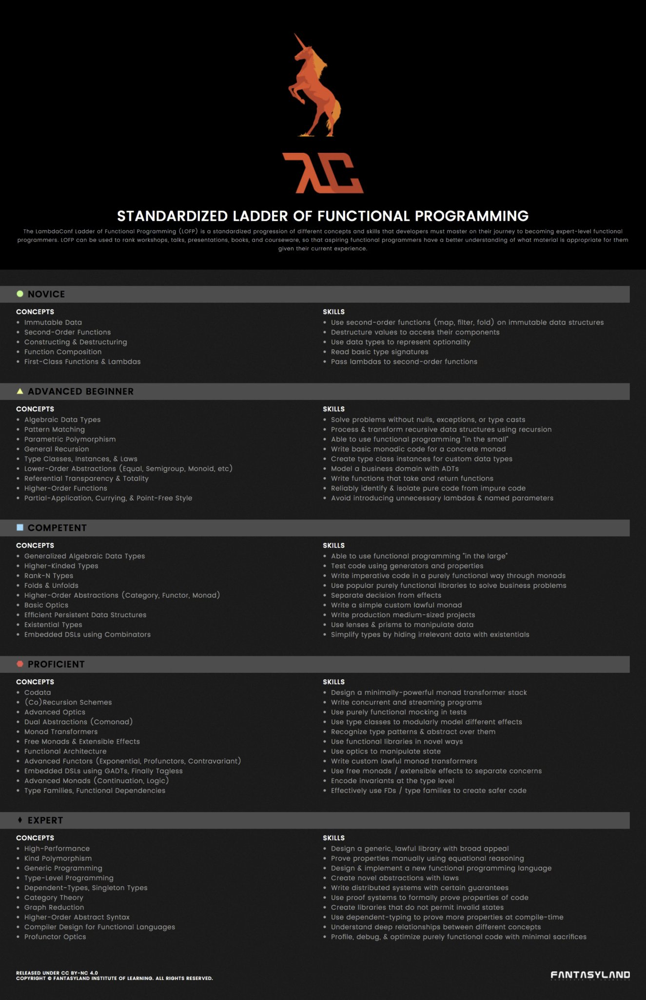

Climbing the FP Ladder
======================

Follow along as I repeat the tale of how I started from a complete FP newbie
and ended up building the [Rasa](https://github.com/chrispenner/rasa) text
editor! I'll present tangible examples, code, and resources for each step of
climbing the ladder to functional mastery. The purpose of this project is to
show that normal people who don't have PhD's in Mathematics can learn these
concepts with a bit of work, and to provide encouragement and resources to those
who'd like to embark on a similar journey. Good luck and Godspeed!

We'll be using this excellent chart put together by [Lambda
Conf](http://lambdaconf.us/) which details a progression of concepts in
increasing difficulty. I've found it to be quite accurate to my own journey,
and also is a great guide as to what you could learn if you're not sure where
to go next!

Here we go!

[Novice](Novice)
------

- [ ] Immutable Data
- [ ] Second-Order Functions
- [ ] Constructing & Destructing
- [ ] Function Composition
- [ ] First-Class Functions & Lambdas

Advanced Beginner
-----------------

- [ ] Algebraic Data Types
- [ ] Pattern Matching
- [ ] Parametric Polymorphism
- [ ] General Recursion
- [ ] Type Classes, Instances, Laws
- [ ] Lower-Order Abstractions (Equal, Semigroup, Monoid, Etc)
- [ ] Referential Transparency & Totality
- [ ] Higher-Order Functions
- [ ] Partial-Application, Currying, Point-Free Style

Competent
---------

- [ ] Generalized Algebraic Data Types
- [ ] Higher-Kinded Types
- [ ] Rank-N Types
- [ ] Folds & Unfolds
- [ ] Higher-Order Abstractions (Category, Functor, Monad)
- [ ] Basic Options
- [ ] Efficient Persistent Data Structures
- [ ] Existential Types
- [ ] Embedded DSLs using Combinators

Proficient
----------

- [ ] Codata
- [ ] (Co)Recursion Schemes
- [ ] Advanced Optics
- [ ] Dual Abstractions (Comonad)
- [ ] Monad Transformers
- [ ] Free Monads & Extensible Effects
- [ ] Functional Architecture
- [ ] Advanced Functors (Exponential, Profunctors, Contravariant)
- [ ] Embedded DSLs using GADTs, Finall Tagless
- [ ] Advanced Monads (Continuation, Logic)
- [ ] Type Families, Functional Dependencies

Expert
------

- [ ] High-Performance
- [ ] Kind Polymorphism
- [ ] Generic Programming
- [ ] Type-Level Programming
- [ ] Dependent-Types, Singleton Types
- [ ] Category Theory
- [ ] Graph Reduction
- [ ] Higher-Order Abstract Syntax
- [ ] Compiler Design for Functional Languages
- [ ] Profunctor Optics

Preface - Learning Styles
-------------------------

For a long time I'd heard of the many benefits of functional programming; and
how it would revolutionize the way I thought about programming in general. I'd
also heard about how difficult it was to learn, or at least how foreign it would
be from anything I'd learned in imperative-land. I had always been to busy; or
perhaps too stubborn to take the productivity hit to take the leap and learn a
functional language. I'd dabbled in Clojure and a few other functional Lisp-likes
but never seemed to build anything worthwhile. 

Back in September of 2017 I decided that I was curious enough to finally take
the plunge and learn some FP for real! I was just starting my 4th and final
year of my B.Sc in Computer Science and I knew I would have a fair amount of
free time during the year in between my assignments and classes; so it seemed
like a good time.

Now; I like to think I know myself pretty well, and I know from past experience
that I best learn new things when I bite off way more than I can chew and start
working on some project with difficult problems I'll need to learn how to solve.
I've grown comfortable with the idea of feeling out of my depth and I know that
as I try to solve a difficult problem I'll eventually gain the insight to split
the problem into a set of smaller problems; repeat recursively until the base case.

So; in light of this I decided I wanted to learn *ALL* the bits of FP; not just
the parts that are good at solving FP problems. It's easy to write a factorial
implementation and think that FP is the best thing ever; but the sad truth is
that not all problems are expressable as a variant of factorial (proof left
as an exercise for the reader ;P). So I decided to choose a project which was in
my mind the exact most challenging thing to do in an FP style; a highly state-driven
and interactive program. I've always been a text editor junky; so what if I
rolled my own? So that's how I started on my first text editor!

Everyone has their own learning styles; so I encourage you to consciously take
some time and find the ones that work for you. For me it happened to be working
through a large project one step at a time and doing lots of examples. Other
folks learn by reading papers or blog posts, chatting with friends, watching
conference talks, etc. Rarely is one of these learning styles sufficient,
you'll need to mix-and-match to find enough content for each topic. I'll try my 
best to provide resources in each style!
